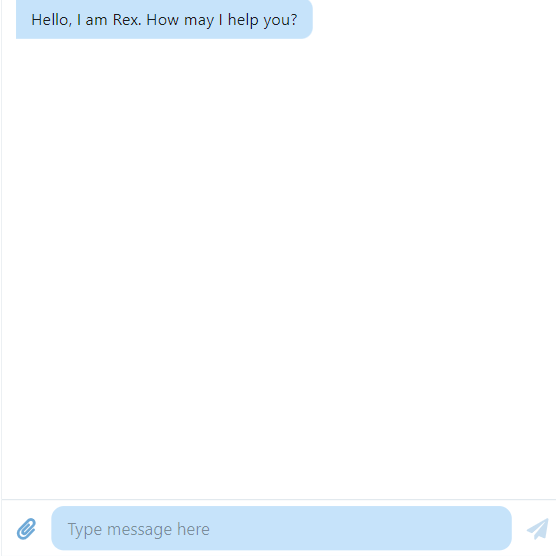

# CosmoChat UI

## Description

This is an app where the user named Andrew interacts with an OpenAI-powered career advice assistant named ReX. This is a beginner mission completed during my internship at RadicalX.

## Tools Used

- React.js
- Chat UI Kit
- Chart.js
- React Router
- OpenAI API

## Acknowledgement

Special thanks to my mentor Billy Bett for helping me get through my blockers and RadicalX CEO Talha Sabri for this opportunity.

## Screenshots

### Welcome Page

This page welcomes the user and allows them to start a chat session with ReX.

### Chat Interface

This is the chat interface where users can send messages to ReX and receive responses.

### Statistics Page

This page displays a graph of the conversation history with ReX and details of each chat session.

---

## How to Use

1. **Home Page**: Start by clicking the "Start Chat With ReX" button to initiate a chat session.
2. **Chat Interface**: Type your messages in the input box and hit enter to communicate with ReX.
3. **Statistics Page**: View your chat history and the number of messages exchanged with ReX.
